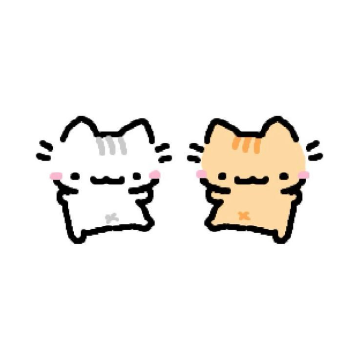

# kaa_nayyyyyyyyyyyyyy
<!DOCTYPE html>
<html>
<head>
	<meta charset="utf-8">
	<meta name="viewport" content="width=device-width, initial-scale=1">
	<title>BONASSSSSSS</title>
</head>
<body>
	<h1>hallo kaa nayyyy</h1>
	<a href="alvin2.html">pencettt</a>
	<h1>aku mau kasih liatt aku buat apaan</h1>
	
</body>
</html>
<!DOCTYPE html>
<html>
<head>
	<meta charset="utf-8">
	<meta name="viewport" content="width=device-width, initial-scale=1">
	<title>bonassss 2</title>
</head>
<body>
	<h1>BONASSS GANTENGGG ૮ ˙Ⱉ˙ ა rawr!</h1>
	
	
anjayyyyy kerenn gakk hehehehehe

	<a href="alvin3.html">pencet lagii</a>
</body>
</html>
<!DOCTYPE html>
<html>
<head>
	<meta charset="utf-8">
	<meta name="viewport" content="width=device-width, initial-scale=1">
	<title>bonassssss</title>
</head>
<body>
	<h1>hallo kaa nayyyy aku mau bilang</h1>
	
makasih kaa nayyyyy apa yang kaa nayyyyy kasih ke aku(˶ᵔ ᵕ ᵔ˶)maap aku belum bisa ngasih apa apa ke kaa nayyyyy(´•︵•`) aku maluu harus nya akuu yang ngasih ke kaa nayyyy maap kaa nayyyy

	<a href="badak.html">bukaaa</a>
</body>
</html>
<!DOCTYPE html>
<html>
<head>
	<meta charset="utf-8">
	<meta name="viewport" content="width=device-width, initial-scale=1">
	<title>bonassssss</title>
</head>
<body>
	<h1>KAA NAYYYY HARUS TETAP SEMANGAT YAHHH JAGA KESEHATAN JANGAN DENGER KATA ORANG ORANG</h1>
	
KAA NAYY HARUS PERCAYA DIRI SENDIRI KALO KAA NAYYYY ITU GA SEBURUK YANG ORANG LAIN BILANGG KAA NAYYYY BAIKK CANTIKKK DI MATA ORANG TEPAT(contoh nya aku (｡- .•)) hehehehhe

	
	
KAA NAYYY JUGA HARUS JAGA KESEHATAN KAA NAYYYY JANGAN TINGGALIN SHOLAT KAA NAYYYY JUGA JANGAN LUPA DOAIN ORANG TUA KAA NAYYYYY TERUS HARUS TERATUR MAKAN NYAA HARUSS BANYAK BIAR SEHATT JANGAN BEGADANG MULUUU ENTARR SAKIT TERUS NGINJEK RUMAH SAKIT TERUS DI SUNTIKK HAYOOO MAU GAA? MANGKANYA JANGAN

	
	
aku juga punya pertanyaan buat kaa nayyyy

	
apa bedanya kaa nayyy sama benda?mau tau jawabannyaa

	<a href="badak2.html">jawaban</a>
</body>
</html>
<!DOCTYPE html>
<html>
<head>
	<meta charset="utf-8">
	<meta name="viewport" content="width=device-width, initial-scale=1">
	<title>bonas baikk</title>
</head>
<body>
	<h1>KALO BENDA LEBIH LAMA JADI ANTIK KALO KAAA NAYYYYY LEBIH LAMA LEBIH CANTIKKK</h1>
	
	
	<a href="badak3.html">ada lagi</a>
</body>
</html>
<!DOCTYPE html>
<html>
<head>
	<meta charset="utf-8">
	<meta name="viewport" content="width=device-width, initial-scale=1">
	<title>bonassssss</title>
</head>
<body>
	
orang kaya mati orang miskin mati orang aku suka nya kamuuu

	
	
Kamu memang seperti lempeng bumi, bergeser sedikit saja sudah menggoncang hatiku

	
	<h1>maap alay dikit</h1>
</body>
</html>

